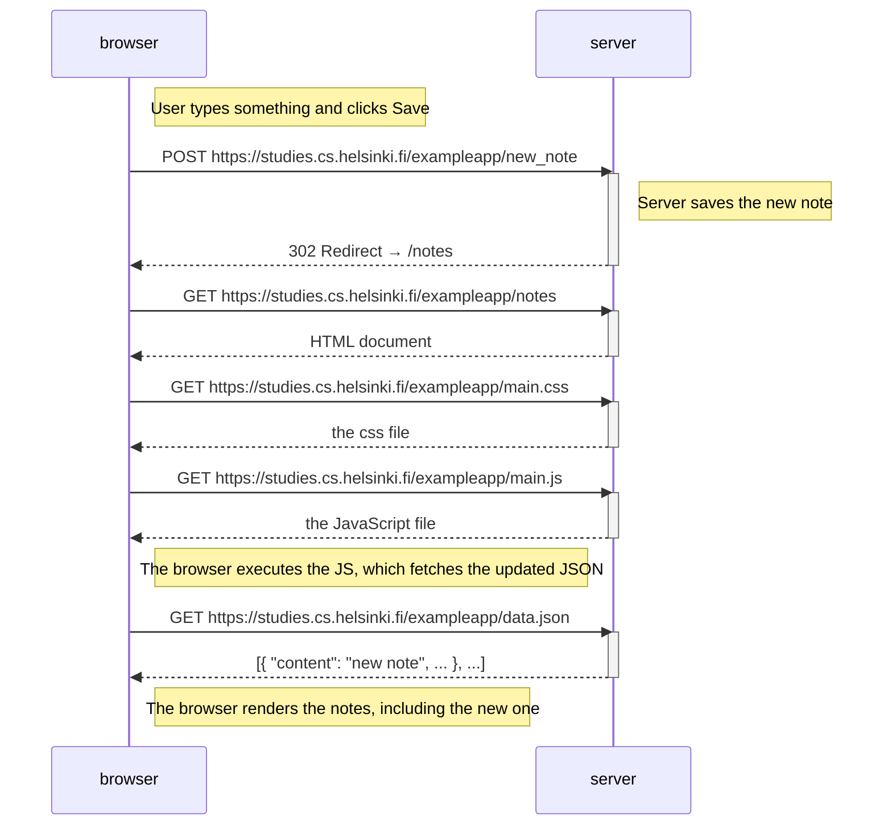
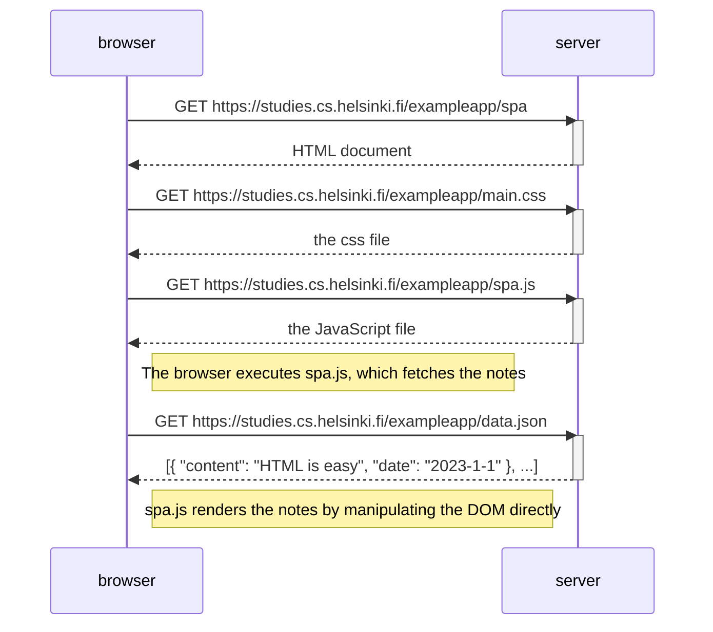
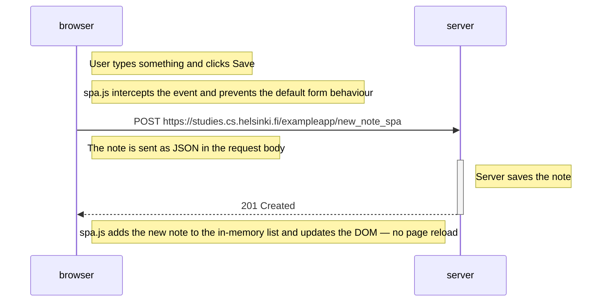

# Part 0 - Diagrams

## 0.4 - New note (traditional app)

```mermaid
sequenceDiagram
    participant browser
    participant server

    Note right of browser: User types something and clicks Save

    browser->>server: POST https://studies.cs.helsinki.fi/exampleapp/new_note
    activate server
    Note right of server: Server saves the new note
    server-->>browser: 302 Redirect → /notes
    deactivate server

    browser->>server: GET https://studies.cs.helsinki.fi/exampleapp/notes
    activate server
    server-->>browser: HTML document
    deactivate server

    browser->>server: GET https://studies.cs.helsinki.fi/exampleapp/main.css
    activate server
    server-->>browser: the css file
    deactivate server

    browser->>server: GET https://studies.cs.helsinki.fi/exampleapp/main.js
    activate server
    server-->>browser: the JavaScript file
    deactivate server

    Note right of browser: The browser executes the JS, which fetches the updated JSON

    browser->>server: GET https://studies.cs.helsinki.fi/exampleapp/data.json
    activate server
    server-->>browser: [{ "content": "new note", ... }, ...]
    deactivate server

    Note right of browser: The browser renders the notes, including the new one
```

## 0.5 - Single page app

```mermaid
sequenceDiagram
    participant browser
    participant server

    browser->>server: GET https://studies.cs.helsinki.fi/exampleapp/spa
    activate server
    server-->>browser: HTML document
    deactivate server

    browser->>server: GET https://studies.cs.helsinki.fi/exampleapp/main.css
    activate server
    server-->>browser: the css file
    deactivate server

    browser->>server: GET https://studies.cs.helsinki.fi/exampleapp/spa.js
    activate server
    server-->>browser: the JavaScript file
    deactivate server

    Note right of browser: The browser executes spa.js, which fetches the notes

    browser->>server: GET https://studies.cs.helsinki.fi/exampleapp/data.json
    activate server
    server-->>browser: [{ "content": "HTML is easy", "date": "2023-1-1" }, ...]
    deactivate server

    Note right of browser: spa.js renders the notes by manipulating the DOM directly
```

## 0.6 - New note in single page app

```mermaid
sequenceDiagram
    participant browser
    participant server

    Note right of browser: User types something and clicks Save
    Note right of browser: spa.js intercepts the event and prevents the default form behaviour

    browser->>server: POST https://studies.cs.helsinki.fi/exampleapp/new_note_spa
    Note right of browser: The note is sent as JSON in the request body
    activate server
    Note right of server: Server saves the note
    server-->>browser: 201 Created
    deactivate server

    Note right of browser: spa.js adds the new note to the in-memory list and updates the DOM — no page reload
```
